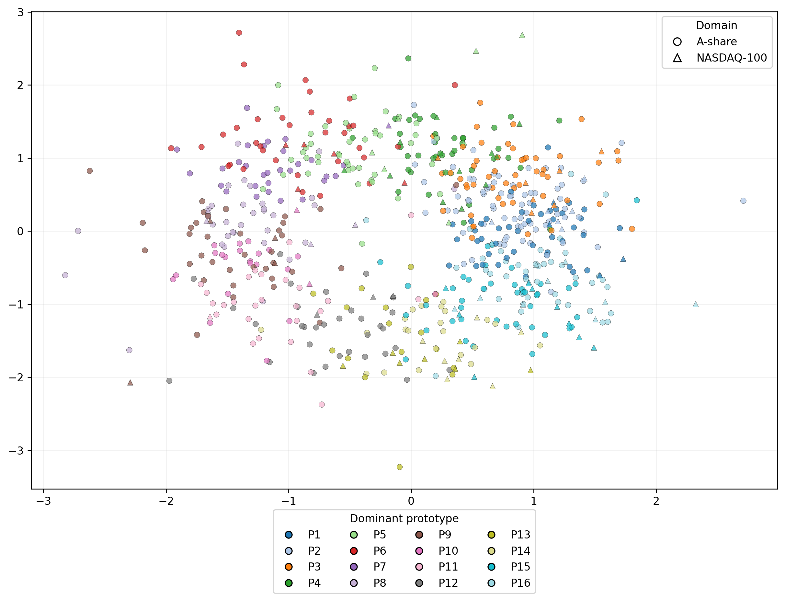
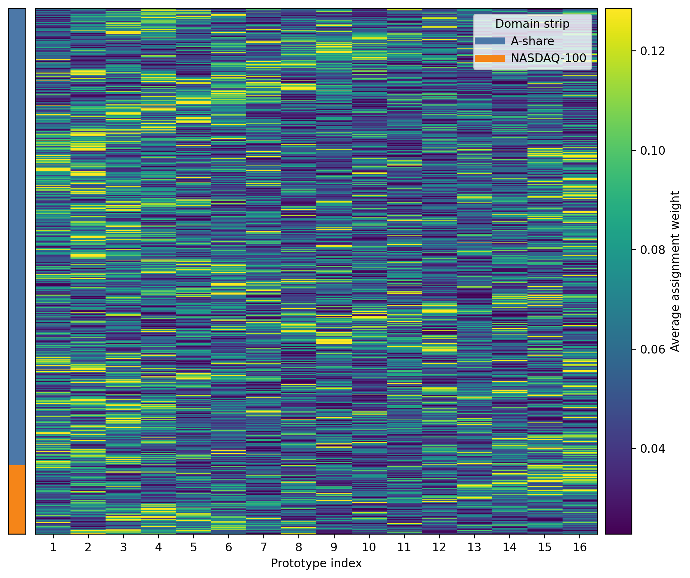
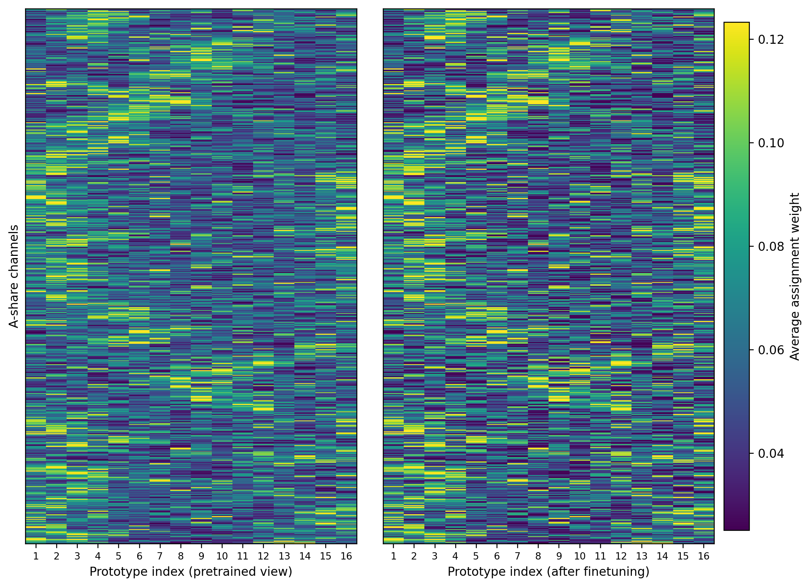

# UniCoRN

- Figure 1. Cross-domain universality of the learned prototype space

Figure 1 visualizes the **channel-level average prototype-assignment profiles** (Formulated in response to **Reviewer FhNn W1**) under **Setting I** with **$K=16$**. Each point is one channel/stock; color indicates the dominant prototype $k_c^{(d)}$, and marker shape indicates the target domain.

- Figure 2. Structured and non-collapsed prototype usage across channels.

Figure 2 is a heatmap of the **channel-level average prototype-assignment profiles** under **Setting I** with **$K=16$**. Each row is one channel/stock, each column one prototype, and each cell the average assignment weight after target adaptation. **A-share** and **NASDAQ-100** channels are stacked together, and the left strip indicates the domain of each row.

- Figure 3. Transfer through reassignment over a shared prototype basis.

Figure 3 compares prototype-assignment patterns on the **A-share** target domain under **Setting I** with **$K=16$**. The left panel shows the **channel-level average prototype-assignment profiles from the pretrained model before finetuning**, and the right panel shows those of the **same channels after finetuning**. In both panels, each row is one channel/stock, each column one prototype, and each cell the average assignment weight. Rows are aligned across panels.